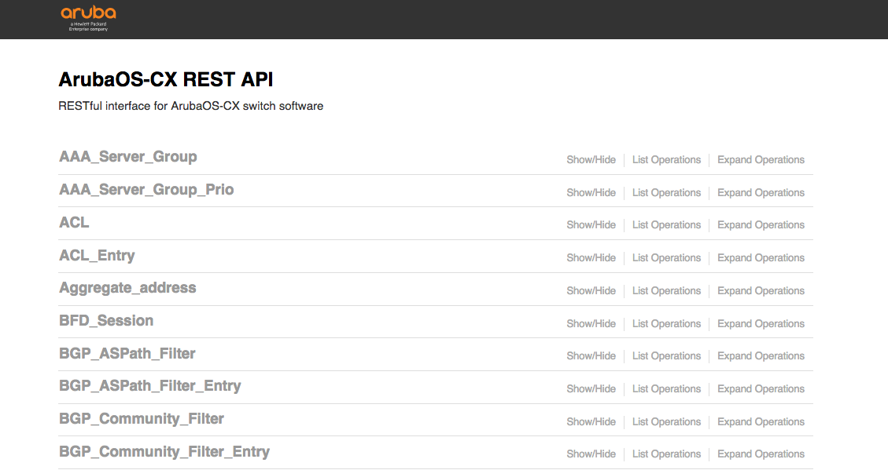
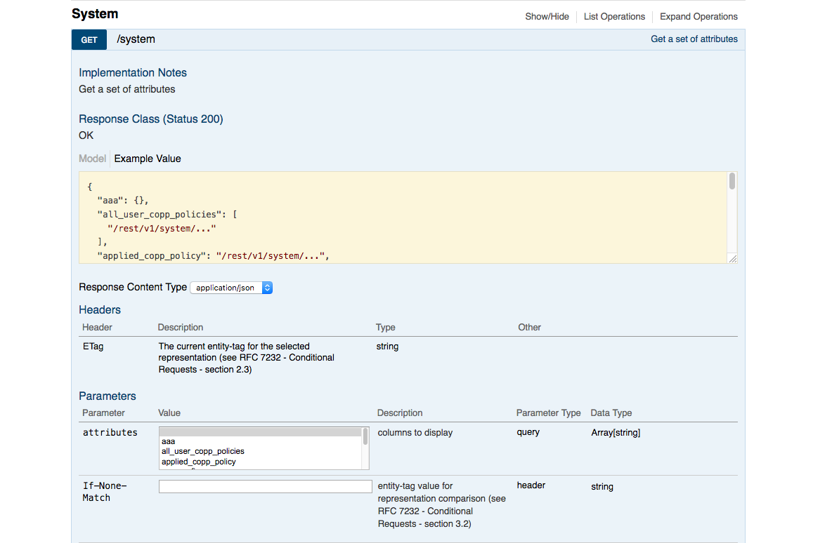

# PowerArubaCX

<p align="center">
    <a href="https://www.powershellgallery.com/packages/PowerArubaCX/" alt="PowerShell Gallery Version">
        </a>
    <a href="https://www.powershellgallery.com/packages/PowerArubaCX/" alt="PS Gallery Downloads">
        </a>
    <!--
    <a href="https://www.powershellgallery.com/packages/PowerArubaCX/" alt="PS Platform">
        </a>
    -->
</p>
<p align="center">
    <a href="https://github.com/PowerAruba/PowerArubaCX/graphs/commit-activity" alt="GitHub Last Commit">
        </a>
    <a href="https://raw.githubusercontent.com/PowerAruba/PowerArubaCX/master/LICENSE" alt="GitHub License">
        </a>
    <a href="https://github.com/PowerAruba/PowerArubaCX/graphs/contributors" alt="GitHub Contributors">
        </a>
</p>
<p align="center">
    <a href="https://twitter.com/PowerAruba" alt="Twitter">
            </a>
</p>

This is a Powershell module for configure an ArubaCX Switch.

<p align="center">

</p>

With this module (version 0.5.0) you can manage:

- [Firmware](#firmware) (Get)
- [Interfaces](#interface) (Add/Get/Set/Remove [LAG](#interface-lag), [Loopback](#interface-loopback), [Vlans](#interface-vlans))
- [LLDP Neighbor](#lldp-neighbor) (Get)
- [System](#System) (Get/Set)
- [Users](#Users) (Get)
- [Vlans](#Vlans-Management) (Add/Get/Set/Remove)
- [VRF](#vrf) (Add/Get/Set/Remove)
- [VM](#vm) (Deploy and Configure ArubaCX OVA (for initial setup))

There is some extra feature
- [Invoke API](#Invoke-API) using Invoke-ArubaCXRestMethod
<!-- - [Filtering](#Filtering) -->
- [Multi Connection](#MultiConnection)

More functionality will be added later.

Tested with ArubaCX 8400 and 832x, 6x00 (using >= 10.04.xx firmware) on Windows/Linux/macOS

# Usage

All resource management functions are available with the Powershell verbs GET, ADD, SET, REMOVE.

For example, you can manage Vlans with the following commands:
- `Get-ArubaCXVlans`
- `Add-ArubaCXVlans`
- `Set-ArubaCXVlans`
- `Remove-ArubaCXVlans`

# Requirements

- Powershell 6 (Core) or 5 (If possible get the latest version)
- An ArubaCX Switch (with firmware >= 10.04.xx) and REST API enable

# Instructions
### Install the module
```powershell
# Automated installation (Powershell 5 and later):
    Install-Module PowerArubaCX

# Import the module
    Import-Module PowerArubaCX

# Get commands in the module
    Get-Command -Module PowerArubaCX

# Get help
    Get-Help Invoke-ArubaCXRestMethod -Full
```

# Examples
### Connecting to the Aruba Switch

The first thing to do is to connect to an ArubaCX Switch with the command `Connect-ArubaCX`:

```powershell
# Connect to the Aruba CX Switch
    Connect-ArubaCX 192.0.2.1

#we get a prompt for credential
```


### Vlans Management

You can create a new Vlan `Add-ArubaCXVlans`, retrieve its information `Get-ArubaCXVlans`, modify its properties `Set-ArubaCXVlans`, or delete it `Remove-ArubaCXVlans`.

```powershell
# Create a vlan
    Add-ArubaCXVlans -id 85 -Name 'PowerArubaCX'

    [...]
    admin                             : up
    clear_ip_bindings                 :
    description                       :
    [...]
    id                                : 85
    [...]
    name                              : PowerArubaCX
    nd_snoop_config                   : @{enable=False; ra_drop_enable=False}
    nd_snooping_prefix                : {}
    oper_state                        : down
    oper_state_reason                 : no_member_port
    [...]
    type                              : static
    voice                             : False
    vsx_sync                          : {}


# Get information about vlan
    Get-ArubaCXVlans -id 85 -attributes admin, description, id, name, type, voice | Format-Table

    admin description id name         type   voice
    ----- ----------- -- ----         ----   -----
    up                85 PowerArubaCX static False

# Change settings of a vlan (Description and voice)
    Get-ArubaCXVlans -id 85 | Set-ArubaCXVlans -description "Add via PowerArubaCX" -voice

    [...]
    admin                             : up
    clear_ip_bindings                 :
    description                       : Add via PowerArubaCX
    [...]
    id                                : 85
    [...]
    name                              : PowerArubaCX
    nd_snoop_config                   : @{enable=False; ra_drop_enable=False}
    nd_snooping_prefix                : {}
    oper_state                        : down
    oper_state_reason                 : no_member_port
    [...]
    type                              : static
    voice                             : True
    vsx_sync                          : {}


# Remove a vlan
    Get-ArubaCXVlans -name PowerArubaCX | Remove-ArubaCXVlans
```

For configure a vlan to an interface, need to use [Set-ArubaCXInterfaces](#Interface)

### Invoke API
for example to get ArubaCX System Configuration

```powershell
# get Aruba CX System configuration using API
    Invoke-ArubaCXRestMethod -method "get" -uri "system" -selector configuration

    aaa                                : @{fail_through=False; login_lockout_time=300; radius_auth=pap; radius_retries=1;
                                        radius_timeout=5; ssh_passkeyauthentication_enable=True;
                                        ssh_publickeyauthentication_enable=True; tacacs_auth=pap; tacacs_timeout=5}
    all_user_copp_policies             : {}
    arp_config                         : @{gc_threshold=131072; timeout=30}
    bfd_detect_multiplier              : 5
    bfd_echo_disable                   : False
    bfd_enable                         : False
    bfd_min_echo_rx_interval           : 500
    bfd_min_rx_interval                : 3000
    bfd_min_tx_interval                : 3000
    checkpoint_post_config             : @{disable=False; timeout=300}
    dhcp_config                        :
    dlog_destination                   :
    dns_servers                        : {}
    ecmp_config                        :
    hostname                           : PowerArubaCX-SW1
    hpe_rda_enable                     : False
    icmp_redirect_disable              : False
    icmp_unreachable_disable           : False
    icmp_unreachable_ratelimit         : 1000

[...]
# get only Aruba CX System hostname and dns servers
    Invoke-ArubaCXRestMethod -method "get" -uri "system" -attributes hostname, dns_servers

    dns_servers hostname
    ----------- --------
    {}          PowerArubaCX-SW1
```

<!--
# get only Aruba CX Interfaces with depth 2 and attributes name...
    Invoke-ArubaCXRestMethod -method "get" -uri "system/interfaces" -depth 2 -attributes name, admin

    name          admin
    ----          ------
    bridge_normal @{error=up}
    1/1/1         @{error=up}
    vlan55        @{error=up}
    1/1/3         @{error=up}
    1/1/2         @{error=up}
    lag1          @{error=up}
    lag2          @{error=up}
    lag5          @{error=up}
    1/1/6         @{error=up}
-->


to get API uri, go to ArubaCX Swagger (https://ArubaCX-IP/api/v10.04/)


And choice a service (for example System)


### Interface

On ArubaCX, on interface, there is all type of interface physical/system and virtual (LAG, Loopback, Vlans)

You can create a new interface (LAG, Loopback, Vlans) `Add-ArubaCXInterfaces`, retrieve its information `Get-ArubaCXInterfaces`, modify its properties `Set-ArubaCXInterfaces` or delete it `Remove-ArubaCXInterfaces`. There is also extra cmdlets for Add `Add-ArubaCXInterfacesVlansTrunks` / Remove `Remove-ArubaCXInterfacesVlansTrunks` Vlans trunks on interface (physical or LAG) or for Add  `Add-ArubaCXInterfacesLagInterface` or Remove  `Remove-ArubaCXInterfacesLagInterface` member (physical) interface on LAG.


#### Interface Physical (System)

```powershell

#Get interface 1/1/1 configuration
    Get-ArubaCXInterfaces 1/1/1 -selector configuration

    aaa_auth_precedence                  :
    aclmac_in_cfg                        :
    aclmac_in_cfg_version                :
    aclmac_out_cfg                       :
    aclmac_out_cfg_version               :
    aclv4_in_cfg                         :
    aclv4_in_cfg_version                 :
    aclv4_out_cfg                        :
    aclv4_out_cfg_version                :
    aclv6_in_cfg                         :
    aclv6_in_cfg_version                 :
    aclv6_out_cfg                        :
    aclv6_out_cfg_version                :
    admin                                : up
    [...]

#Get name, admin state and link state of interface

    Get-ArubaCXInterfaces 1/1/1 -attributes name, admin_state, link_state

    admin_state link_state name
    ----------- ---------- ----
    down        down       1/1/1

#Configure interface 1/1/1 (Description, admin and routing)

    Get-ArubaCXInterfaces 1/1/1 | Set-ArubaCXInterfaces -description "Changed by PowerArubaCX" -admin up -routing:$false

    [...]
    admin                                   : up
    [...]
    description                             : Changed by PowerArubaCX
    [...]
    name                                    : 1/1/1
    [...]
    routing                                 : False
    [...]

#Configure interface 1/1/1 on vlan access 85

    Get-ArubaCXInterfaces -interface 1/1/1 | Set-ArubaCXInterfaces -vlan_mode access -vlan_tag 85

    name                                    : 1/1/1
    [...]
    vlan_mode                               : access
    vlan_tag                                : @{85=/rest/v10.04/system/vlans/85}
    [...]

#Configure interface 1/1/1 on native-untagged mode with vlan 85 and tagged vlan 44

    Get-ArubaCXInterfaces -interface 1/1/1 | Set-ArubaCXInterfaces -vlan_mode native-untagged -vlan_tag 85 -vlan_trunks 44

    name                                    : 1/1/1
    [...]
    vlan_mode                               : native-untagged
    vlan_tag                                : @{85=/rest/v10.04/system/vlans/85}
    vlan_trunks                             : @{44=/rest/v10.04/system/vlans/44}

#Configure interface 1/1/1 and add vlan 45 to trunks

    Get-ArubaCXInterfaces -interface 1/1/1 | Add-ArubaCXInterfacesVlanTrunks -vlan_trunks 45

    name                                    : 1/1/1
    [...]
    vlan_mode                               : native-untagged
    vlan_tag                                : @{85=/rest/v10.04/system/vlans/85}
    vlan_trunks                             : @{44=/rest/v10.04/system/vlans/44; 45=/rest/v10.04/system/vlans/45}
    [...]

#Configure interface 1/1/1 with a IPv4 address

    Get-ArubaCXInterfaces -interface 1/1/1 | Set-ArubaCXInterfaces -ip4_address 192.0.2.1 -ip4_mask 24

    name                                    : 1/1/1
    [...]
    ip4_address                             : 192.0.2.1/24
    [...]
```

#### Interface LAG

```powershell

#Add LAG 1 with member interface 1/1/1

    Add-ArubaCXInterfaces -lag_id 1 admin up -interfaces 1/1/3 -lacp active

    name                                    : lag1
    [...]
    interfaces                              : @{1/1/3=/rest/v10.09/system/interfaces/1%2F1%2F3}
    [...]
    lacp                                    : active
    [...]

#Configure Access vlan 44 on LAG 1

    Get-ArubaCXInterfaces lag1 | Set-ArubaCXInterfaces -vlan_tag 44 -vlan_mode access

    name                                    : lag1
    [...]
    vlan_mode                               : access
    vlan_tag                                : @{44=/rest/v10.09/system/vlans/44}
    [...]

#Configure Trunk vlan 44,45 on LAG 1

    Get-ArubaCXInterfaces lag1 | Set-ArubaCXInterfaces -vlan_tag 1 -vlan_trunks 44,45 -vlan_mode native-untagged 

    name                                    : lag1
    [...]
    vlan_mode                               : native-untagged
    vlan_tag                                : @{1=/rest/v10.09/system/vlans/1}
    vlan_trunks                             : @{44=/rest/v10.09/system/vlans/44; 45=/rest/v10.09/system/vlans/45}
    [...]

#Add interface 1/1/2 on LAG 1

    Get-ArubaCXInterfaces lag1 | Add-ArubaCXInterfacesLagInterfaces -interfaces 1/1/2

    name                                    : lag1
    [...]
    interfaces                              : @{1/1/2=/rest/v10.09/system/interfaces/1%2F1%2F2; 1/1/3=/rest/v10.09/system/interfaces/1%2F1%2F3}
    [...]
    lacp                                    : active
    [...]

#Remove interface 1/1/3 on LAG 1

    Get-ArubaCXInterfaces lag1 | Remove-ArubaCXInterfacesLagInterfaces -interfaces 1/1/3

    name                                    : lag1
    [...]
    interfaces                              : @{1/1/2=/rest/v10.09/system/interfaces/1%2F1%2F2}
    [...]
    lacp                                    : active
    [...]

#Remove LAG 1

    Get-ArubaCXInterfaces lag1 | Remove-ArubaCXInterfaces

    Confirm
    Are you sure you want to perform this action?
    Performing the operation "Remove interface" on target "lag1".
    [Y] Yes  [A] Yes to All  [N] No  [L] No to All  [S] Suspend  [?] Help (default is "Y"): Y
```

#### Interface Loopback

```powershell

#Add interface loopback 1 with a IPv4 Address (you need to add vlan before)

    Add-ArubaCXInterfaces -loopback_id 1 -ip4_address 192.0.2.44 -ip4_mask 24

    name                                    : loopback1
    [...]
    active_ip4_address                      : 192.0.2.44/24
    [...]
    ip4_address                             : 192.0.2.44/24
    [...]

#Change IP Address of interface loopback 1

    Get-ArubaCXInterfaces loopback1 | Set-ArubaCXInterfaces -ip4_address 192.0.2.254 -ip4_mask 24

    name                                    : loopback1
    [...]
    active_ip4_address                      : 192.0.2.254/24
    [...]
    ip4_address                             : 192.0.2.254/24
    [...]

#Set VRF Blue on interface loopback 1(need to create vrf before)

    Get-ArubaCXInterfaces loopback1 | Set-ArubaCXInterfaces -vrf blue

    name                                    : loopback1
    [...]
    vrf                                     : @{blue=/rest/v10.09/system/vrfs/blue}
    [...]

#Remove interface loopback 1

    Get-ArubaCXInterfaces loopback1 | Remove-ArubaCXInterfaces

    Confirm
    Are you sure you want to perform this action?
    Performing the operation "Remove interface" on target "loopback1".
    [Y] Yes  [A] Yes to All  [N] No  [L] No to All  [S] Suspend  [?] Help (default is "Y"): Y
```

#### Interface Vlans

```powershell

#Add interface vlan 44 with a IPv4 Address (you need to add vlan before)

    Add-ArubaCXInterfaces -vlan_id 44 -ip4_address 192.0.2.44 -ip4_mask 24

    name                                    : vlan44
    [...]
    active_ip4_address                      : 192.0.2.44/24
    [...]
    ip4_address                             : 192.0.2.44/24
    [...]

#Change IP Address of interface vlan 44

    Get-ArubaCXInterfaces vlan44 | Set-ArubaCXInterfaces -ip4_address 192.0.2.254 -ip4_mask 24

    name                                    : vlan44
    [...]
    active_ip4_address                      : 192.0.2.254/24
    [...]
    ip4_address                             : 192.0.2.254/24
    [...]

#Set VRF Blue on interface vlan 44 (need to create vrf before)

    Get-ArubaCXInterfaces vlan44 | Set-ArubaCXInterfaces -vrf blue

    name                                    : vlan44
    [...]
    vrf                                     : @{blue=/rest/v10.09/system/vrfs/blue}
    [...]

#Remove interface vlan 44

    Get-ArubaCXInterfaces vlan44 | Remove-ArubaCXInterfaces

    Confirm
    Are you sure you want to perform this action?
    Performing the operation "Remove interface" on target "vlan44".
    [Y] Yes  [A] Yes to All  [N] No  [L] No to All  [S] Suspend  [?] Help (default is "Y"): Y
```

### LLDP Neighbor

```powershell

#Get LLDP Neighbor of All Ports

    Get-ArubaCXLLDPNeighbor

    %2F1%2F8                                                                                                                1%2F1%2F9
    ---------                                                                                                                ---------
    @{08:00:09:0d:2d:06,1/1/9=/rest/v10.09/system/interfaces/1%2F1%2F8/lldp_neighbors/08%3A00%3A09%3A0d%3A2d%3A06,1%2F1%2F9} @{08:00:09:0d:2d:06,1/1/8=/rest/v10.09/system/interfaces/1%2F1%2F9/lldp_neighbors/08%3A00%3A09%3…

#Get LLDP Neighbor of port 1/1/8 with depth 2

    Get-ArubaCXLLDPNeighbor 1/1/8 -depth 2

    08:00:09:0d:2d:06,1/1/9
    -----------------------
    @{chassis_id=08:00:09:0d:2d:06; dcbx_cee_status=; mac_addr=08:00:09:0d:2d:06; med_network_policy=; neighbor_info=; neighbor_info_organizational=; port_id=1/1/9}

#To Get all info, you can use

    (Get-ArubaCXLLDPNeighbor 1/1/8 -depth 2).'08:00:09:0d:2d:06,1/1/9'

    chassis_id                   : 08:00:09:0d:2d:06
    dcbx_cee_status              :
    mac_addr                     : 08:00:09:0d:2d:06
    med_network_policy           :
    neighbor_info                : @{associated_poe_tlv_for_pd=dot3; chassis_capability_available=Bridge, Router; chassis_capability_enabled=Bridge, Router; chassis_description=Aruba ABC123  Virtual.10.09.0002;
                                chassis_id_len=6; chassis_id_subtype=link_local_addr; chassis_index=1; chassis_name=switch; chassis_protocol=LLDP; chassis_refcount=2; chassis_ttl=120; eee_wake_time_fallback=0;
                                eee_wake_time_rx=0; eee_wake_time_rx_echo=0; eee_wake_time_tx=0; eee_wake_time_tx_echo=0; macphy_autoneg_advertised=Other; macphy_autoneg_enabled=0; macphy_autoneg_support=0;
                                macphy_mau_type= ; mgmt_iface_list=33554433; mgmt_iface_oid_list=1.3.6.1.2.1.31.1.1.1.1.33554433; mgmt_ip_list=192.0.2.44; pd_dot3_ext_tlv_advertised=False; pd_dot3_tlv_advertised=False;
                                pd_med_tlv_advertised=False; port_description=1/1/9; port_hidden_in=0; port_hidden_out=0; port_id_len=5; port_id_subtype=if_name;port_lastchange=61ed751e; port_lastupdate=61ed764a;
                                port_mfs=0; port_protocol=LLDP; power_allocated=0; power_allocated_pair_a=0; power_allocated_pair_b=0; power_class=Class0; power_devicetype=PSE; power_enabled=1; power_paircontrol=0;
                                power_pairs=SIGNAL; power_powertype=None; power_priority=Unknown; power_requested=0; power_requested_pair_a=0; power_requested_pair_b=0; power_source=Unknown; power_supported=1;
                                remote_index=2}
    neighbor_info_organizational : @{1=; 2=; 3=}
    port_id                      : 1/1/9

#and for neighbor info

    (Get-ArubaCXLLDPNeighbor 1/1/8 -depth 2).'08:00:09:0d:2d:06,1/1/9'.neighbor_info

    associated_poe_tlv_for_pd    : dot3
    chassis_capability_available : Bridge, Router
    chassis_capability_enabled   : Bridge, Router
    chassis_description          : Aruba ABC123  Virtual.10.09.0002
    chassis_id_len               : 6
    chassis_id_subtype           : link_local_addr
    chassis_index                : 1
    chassis_name                 : switch
    chassis_protocol             : LLDP
    chassis_refcount             : 2
    chassis_ttl                  : 120
    eee_wake_time_fallback       : 0
    eee_wake_time_rx             : 0
    eee_wake_time_rx_echo        : 0
    eee_wake_time_tx             : 0
    eee_wake_time_tx_echo        : 0
    macphy_autoneg_advertised    : Other
    macphy_autoneg_enabled       : 0
    macphy_autoneg_support       : 0
    macphy_mau_type              :
    mgmt_iface_list              : 33554433
    mgmt_iface_oid_list          : 1.3.6.1.2.1.31.1.1.1.1.33554433
    mgmt_ip_list                 : 192.0.2.44
    pd_dot3_ext_tlv_advertised   : False
    pd_dot3_tlv_advertised       : False
    pd_med_tlv_advertised        : False
    port_description             : 1/1/9
    port_hidden_in               : 0
    port_hidden_out              : 0
    port_id_len                  : 5
    port_id_subtype              : if_name
    port_lastchange              : 61ed751e
    port_lastupdate              : 61ed7686
    port_mfs                     : 0
    port_protocol                : LLDP
    power_allocated              : 0
    power_allocated_pair_a       : 0
    power_allocated_pair_b       : 0
    power_class                  : Class0
    power_devicetype             : PSE
    power_enabled                : 1
    power_paircontrol            : 0
    power_pairs                  : SIGNAL
    power_powertype              : None
    power_priority               : Unknown
    power_requested              : 0
    power_requested_pair_a       : 0
    power_requested_pair_b       : 0
    power_source                 : Unknown
    power_supported              : 1
    remote_index                 : 2

```

### Firmware
Tor Get Firmware information on Aruba CX Switch

```powershell

#Get Firmware info

    Get-ArubaCXFirmware -attribute current_version -Verbose

    current_version   : FL.10.09.0002
    primary_version   : FL.10.09.0002
    secondary_version : FL.10.09.0002
    default_image     : primary
    booted_image      : primary

#Get Firmware Status

    Get-ArubaCXFirmware -status

    date reason status
    ---- ------ ------
    0    none   none

```

### System
for example to get/set ArubaCX System settings

```powershell

#Get ALL system settings

    Get-ArubaCXSystem

    aaa                                             : @{dot1x_auth_enable=False; dot1x_remote_auth_method=eap-radius; fail_through=False; login_lockout_time=300; 
                                                    mac_auth_address_format=no-delimiter; mac_auth_enable=False; mac_auth_radius_auth_method=chap; 
                                                    portaccess_local_accounting_enable=False; radius_auth=pap; radius_retries=1; radius_timeout=5; 
                                                    radius_tracking_time_interval=300; radius_tracking_user_name=radius-tracking-user; tacacs_auth=pap; 
                                                    tacacs_timeout=5; tacacs_tracking_time_interval=300; tacacs_tracking_user_name=tacacs-tracking-user}
    aaa_accounting_attributes                       : /rest/v10.04/system/aaa_accounting_attributes
    aaa_server_group_prios                          : /rest/v10.04/system/aaa_server_group_prios
    aaa_server_groups                               : /rest/v10.04/system/aaa_server_groups
    acl_object_groups                               : /rest/v10.04/system/acl_object_groups
    acls                                            : /rest/v10.04/system/acls
    admin_password_set                              : True
    [...]

#Get hostname and timezone system settings

    Get-ArubaCXSystem -attribute hostname, timezone

    hostname    timezone
    --------    --------
    switch      UTC

#Set hostname

    Set-ArubaCXSystem -hostname PowerArubaCX-Switch

    [...]
    hostname                                        : PowerArubaCX-Switch
    [...]

#Set timezone

    Set-ArubaCXSystem -timezone Europe/Paris

    [...]
    timezone                                        : Europe/Paris
    [...]

#Set a setting don't have (yet) parameter (usb_disable)

    $system = Get-ArubaCXSystem -selector writable
    $system.usb_disable = $true
    $system | Set-ArubaCXSystem -use_pipeline

    [...]
    usb_disable                                     : True
    [...]
```
### Users
You can get Users (local account) of Aruba CX

```powershell

#Get ALL local user
    Get-ArubaCXUsers

    admin
    -----
    /rest/v10.09/system/users/admin

#Get info about admin local user

    Get-ArubaCXUsers -user admin

    authorized_keys :
    name            : admin
    origin          : built-in
    password        : AQBapU0TkclkN5abVvBfWakRLdEwQAuF4jP3oqWRlwxj4avqYgAAAFw0UPMjwXH1xvCD00IaJ5YMo+OxvaA853gdPSu4cjkzvYlKIuQvQ52v6YH1wtxbBIU5nht+RMM2thytQZO7PNut4PNFnNwUP22h0Aq16IdEy2Oc2ma0csZ00l+TaGa4o8Ja
    user_group      : @{administrators=/rest/v10.09/system/user_groups/administrators}

```

### VRF

You can create a new VRF `Add-ArubaCXVrfs`, retrieve its information `Get-ArubaCXVrfs`, modify its properties `Set-ArubaCXVrfs`, or delete it `Remove-ArubaCXVrfs`.

```powershell

# Create a vrf
    Add-ArubaCXVrfs -name blue

    [...]
    https_server                            :
    [...]
    name                                    : blue
    [...]
    rd                                      :
    [...]
    snmp_enable                             : False
    [...]
    source_interface                        :
    source_ip                               :
    ssh_enable                              :
    [...]

# Get information about a vrf
    Get-ArubaCXvrfs -name blue -attributes name, https_server, rd, ssh_enable, snmp_enable

    https_server :
    name         : blue
    rd           :
    snmp_enable  : False
    ssh_enable   :

# Change settings of a vrf (rd, snmp, ssh, https)
    Get-ArubaCXVrfs blue | Set-ArubaCXVrfs -ssh_enable -https_server -snmp_enable -rd 11:22

    [...]
    https_server                            : @{enable=True}
    [...]
    name                                    : blue
    [...]
    rd                                      : 11:22
    [...]
    snmp_enable                             : True
    [...]
    source_interface                        :
    source_ip                               :
    ssh_enable                              : True
    [...]

# Remove a vrf
    Get-ArubaCXVrfs blue | Remove-ArubaCXVrfs

    Confirm
    Are you sure you want to perform this action?
    Performing the operation "Remove Vrf blue" on target "Vrf".
    [Y] Yes  [A] Yes to All  [N] No  [L] No to All  [S] Suspend  [?] Help (default is "Y"): Y
```

### VM

You can use PowerArubaCX for help to deploy Aruba CX OVA on VMware ESXi (With a vCenter)
You need to have [VMware.PowerCLI](https://developer.vmware.com/powercli) and [Set-VMKeystrokes](https://www.powershellgallery.com/packages/VMKeystrokes/1.0.0) from [William Lam](https://williamlam.com/2017/09/automating-vm-keystrokes-using-the-vsphere-api-powercli.html)

You can use the following cmdlet (on this order)

- `Deploy-ArubaCXVm` Deploy CPPM OVA with add hard disk
- `Set-ArubaCXVMFirstBootPassword` Configure first boot (Password...)
- `Set-ArubaCXVMMgmtOobm` Configure OOBM Interface (ip, default-gateway)

### MultiConnection

From release 0.4.0, it is possible to connect on same times to multi Aruba CX
You need to use -connection parameter to cmdlet

For example to get system of 2 ArubaCX

```powershell
# Connect to first ArubaCX
    $cx1 = Connect-ArubaCX 192.0.2.1 -SkipCertificateCheck -DefaultConnection:$false

#DefaultConnection set to false is not mandatory but only don't set the connection info on global variable

# Connect to second ArubaCX
    $cx2 = Connect-ArubaCX 192.0.2.2 -SkipCertificateCheck -DefaultConnection:$false

    # Get System hostname and mgmt  interface for first ArubaCX Switch
    Get-ArubaCXSystem -attributes mgmt_intf, hostname -connection $cx1

    hostname             mgmt_intf
    --------             ---------
    PowerArubaCX-Switch1 @{admin_state=up; default_gateway=10.200.11.254; dns_server_1=10.200.11.254; dns_server_2=0.0.0.0; ip=10.200.11.1; mode=static;

# Get Interface for second ArubaCX Switch
    Get-ArubaCXSystem -attributes mgmt_intf, hostname -connection $cx2

    hostname             mgmt_intf
    --------             ---------
    PowerArubaCX-Switch2 @{admin_state=up; default_gateway=10.200.11.254; dns_server_1=10.200.11.254; dns_server_2=0.0.0.0; ip=10.200.11.2; mode=static;

#Each cmdlet can use -connection parameter

```

### Disconnecting

```powershell
# Disconnect from the Aruba CX Switch
    Disconnect-ArubaCX
```

# List of available command
```powershell
Add-ArubaCXInterfacesVlanTrunks
Add-ArubaCXVlans
Confirm-ArubaCXInterfaces
Confirm-ArubaCXSystem
Confirm-ArubaCXVlans
Connect-ArubaCX
Disconnect-ArubaCX
Get-ArubaCXFirmware
Get-ArubaCXInterfaces
Get-ArubaCXLLDPNeighbor
Get-ArubaCXSystem
Get-ArubaCXUser
Get-ArubaCXVlans
Invoke-ArubaCXRestMethod
Remove-ArubaCXInterfacesVlanTrunks
Remove-ArubaCXVlans
Set-ArubaCXCipherSSL
Set-ArubaCXInterfaces
Set-ArubaCXSystem
Set-ArubaCXuntrustedSSL
Set-ArubaCXVlans
Show-ArubaCXException
```

# Author

**Alexis La Goutte**
- <https://github.com/alagoutte>
- <https://twitter.com/alagoutte>

# Special Thanks

- Warren F. for his [blog post](http://ramblingcookiemonster.github.io/Building-A-PowerShell-Module/) 'Building a Powershell module'
- Erwan Quelin for help about Powershell

# License

Copyright 2018-2020 Alexis La Goutte and the community.
